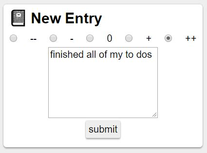

## Daily Sentiment Journal

_Daily Sentiment Journal_ is a simple tool for logging how your day went. Journal entries consist of a value between '--' to '++' that represents how good of a day it was, the date and you also have the option of including a note. Your sentiment over time is visualized on a calendar heatmap similar to github's contribution map ([react-calendar-heatmap](https://github.com/patientslikeme/react-calendar-heatmap)).

## How to Use

Log in with a Google account. Then to make a new entry just pick the value that correspond's with how your day went, add a note if you'd like and press the submit button.

## Installation

Clone the repo:
`git clone https://github.com/mccaffertycr/dsj.git`

Install dependencies:
`yarn install && cd client && yarn install`

Run in dev mode:
`cd .. && yarn dev`
